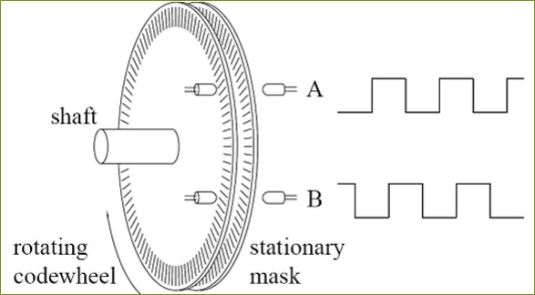
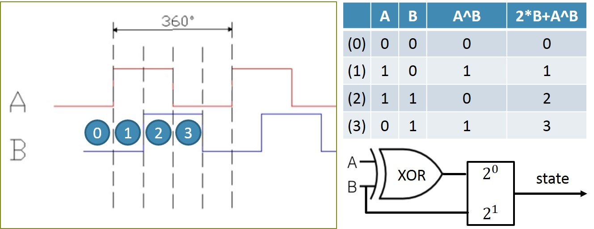
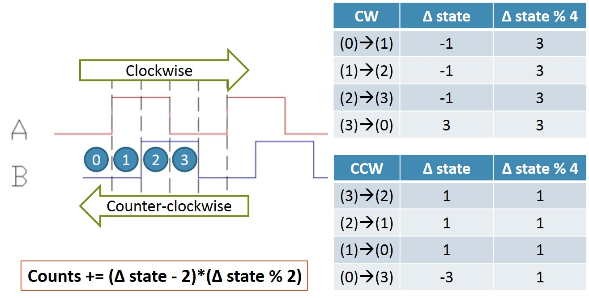

# C + BCM2835 Quadrature Encoder

## Rotary encoders
   
 
An optical encoder "channel" is composed of a pair of light (optical signal) emitter and receiver.  
The stationary codewheel has alternating opaque and transparent sections (stripes) on it. When optical signals are able to be received (i.e. between the emitter and receiver is a transparent section), the channel outputs a HIGH (1) digital signal. Otherwise the channel outputs a LOW (0) one.  
When our motor shaft starts rotating, the optical channels start to output HIGH and LOW signals alternatively, hence generates a square wave signal, shown in the image above.  
We detect triggers (both falling and rising edges) to determine occurance of a state transition.
 

## Encoder logic (1): State
   
 
A "Quadrature" encoder means that there are 2 channels (A, B) * 2 states (1, 0) = 4 possible combinations (states).  
Here I represent the encoder state with an XOR logic analogy, shown in the table in above image.  
 

## Encoder logic (2): Direction
   
 
What differs a quadrature encoder from a regular one (or with only one channel) is that with the extra channel, rotation direction of motor shaft can now be determined.  
We compare the current state with the previous one to determine the rotation direction. Details are described in the image above.  
 

## Libraries
BCM2835 edge triggering usage is described in the code.  
We use threading for synchronously reading from different channels and transmitting counts.  
 

## Hardware setup
Corresponding pins:  
 
define FXA RPI_GPIO_P1_11  
define FXB RPI_GPIO_P1_15  
define FYA RPI_GPIO_P1_16  
define FYB RPI_GPIO_P1_18  
 
define RXA RPI_GPIO_P1_10  
define RXB RPI_GPIO_P1_08  
define RYA RPI_GPIO_P1_19  
define RYB RPI_GPIO_P1_21  
 
